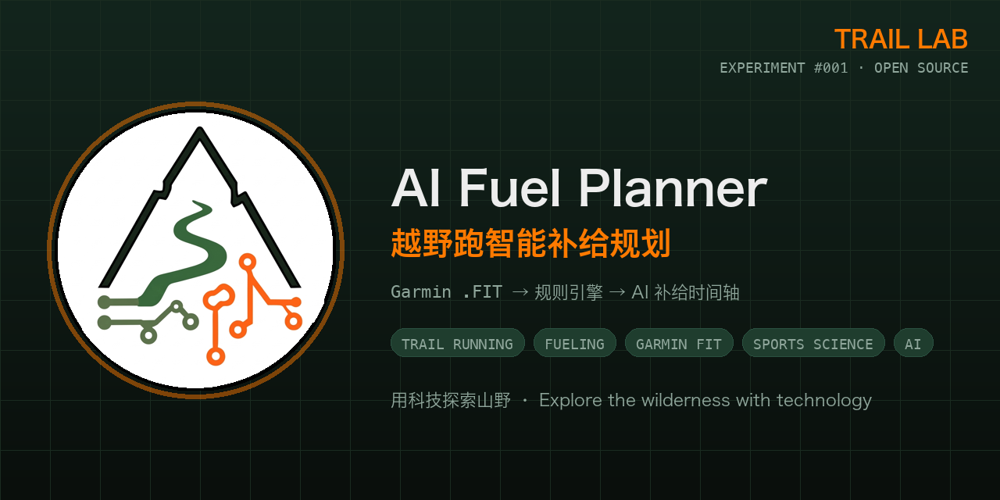

<p align="center">
  
</p>

<h1 align="center">🏔️ Trail Lab · AI Fuel Planner</h1>

<p align="center">
  <strong>越野跑补给 AI 规划工具</strong> ·
  <em>Garmin .FIT 数据 + 规则引擎 + AI 补给时间轴</em>
</p>

<p align="center">
  <a href="https://marsdace.github.io/AI-Fuel-Planner/"></a>
  <a href="https://github.com/marsdace/AI-Fuel-Planner"></a>
  <a href="LICENSE"></a>
  <a href="README_EN.md"></a>
</p>

<p align="center">
  <b>Trail Lab（山野实验室）Experiment #001</b> — 用真实实验验证科技是否值得带进户外。<br/>
  <em>Explore the wilderness with technology — making the outdoors more fun, efficient, and safe.</em>
</p>

---

## 🚀 立即试用（GitHub Pages 在线版）

> 无需安装、无需服务器，浏览器打开即可使用：上传你自己的 Garmin `.fit` 文件，本地解析，数据不上传。

### 👉 https://marsdace.github.io/AI-Fuel-Planner/

**功能一览（5 步完成补给规划）**：上传历史 FIT → 校准能力画像 → 设定目标路线 → 确认海拔/补给点 → 规则引擎 + AI 补给时间轴。

---

## ✨ 这是什么？

**AI Fuel Planner** 解决越野跑/徒步爱好者的一个具体问题：*如何把历史运动数据转换成下一次活动的补给决策？*

上传 Garmin 手表的历史运动文件（`.fit`），设定目标路线（距离、爬升、补给点、天气），程序用**运动营养规则引擎**计算碳水 / 液体 / 钠的摄入量与补给时间轴，再由 **AI 生成可执行的自然语言解释**。

**核心设计原则 —— 数据优先于 AI**：

```
上传 Garmin .FIT 文件
      ↓  （浏览器本地解析，数据不上传）
规则引擎计算补给量（碳水 / 液体 / 钠 / 补给点）
      ↓  （确定性计算，程序负责）
AI 生成自然语言解释（可选，只解释不算）
```

> 程序负责所有数学计算，AI 只负责把结果翻译成可执行的建议 —— 禁止 AI 编造数值。

---

## 🎯 目标用户

- 🏃 越野跑 / 徒步 / 耐力运动爱好者
- ⌚ Garmin、Coros、Apple Watch 用户（FIT 格式）
- 📊 喜欢用数据优化训练、相信"验证"而非"宣传"的极客
- 🧪 关注运动营养（碳水、电解质、补给节奏）的跑者

---

## ⚡ 核心特性

- **浏览器本地解析 Garmin FIT**：通过官方 `@garmin/fitsdk` 解码，`file://` 双击或任意静态服务器即可运行，**原始运动数据不上传**
- **五步引导流程**：历史运动 → 用户画像 → 路线参数 → 海拔/补给概况 → 规则引擎 + AI 解释
- **爬升/下降路段建模**：按爬升率分段（阈值可配置，默认 50m），匹配不同补给密度
- **补给点规划**：官方 CP 输入 + 自动等效拆分 + 爬升触发点 + 时间兜底
- **规则契约 JSON**：所有数值由规则引擎输出固定契约，AI 只解释、不编造
- **双语支持**：中文 / English 一键切换
- **零依赖部署**：原生 ES2020+，无框架、无构建步骤
- **AI 可切换**：DeepSeek / OpenAI / Gemini / mock

---

## 🚀 快速开始

```bash
# 方式一：直接打开（推荐现代浏览器）
open index.html

# 方式二：本地静态服务器
python3 -m http.server 8080
# 访问 http://localhost:8080
```

> 提示：若直接双击 `file://` 打开时 FIT SDK（esm.sh）加载失败，请改用本地静态服务器。

### 一次完整的规划流程

1. **步骤 1** — 上传自己的历史运动文件（Garmin `.fit`），或选择「手动填写用户信息」
2. **步骤 2** — 校准用户能力画像（HR 区间、体重、静息心率、ITRA/UTMB 积分）
3. **步骤 3** — 设定目标路线：距离、总爬升、天气、官方补给点、爬升/下降路段（含阈值）
4. **步骤 4** — 确认路线海拔概况图（海拔轮廓 + 补给点分布 + 路段色带）
5. **步骤 5** — 选择 AI Provider（可先用 `mock` 验证全流程），点击「开始计算并生成解释」

---

## 📁 项目结构

```
AI-Fuel-Planner/                 # 仓库根目录 = 03_Code 文件夹
├── index.html                   # ★ 主程序（纯 JS 静态 Web 应用）
├── app.js                       #   逻辑：FIT 解析 / 画像 / 规则引擎 / 图表 / AI
├── styles.css                   #   页面样式（深林绿 × 探索橙主题）
├── bg.js                        #   森林夜空动效背景
├── logo.png                     #   Trail Lab 品牌头像
├── banner.png                   #   README 横幅
├── LICENSE                      #   MIT 许可
├── PROTOCOL_ZH.md / _EN.md      #   使用协议与许可声明（中/英）
├── THIRD_PARTY_NOTICES.md       #   第三方组件许可
├── README.md / README_EN.md     #   说明文档（本文件）
└── python_legacy/               # ⚠️ 已弃用的 Python 测试版（历史存档）
```

---

## 🧰 技术栈

- **前端**：原生 JavaScript（ES2020+）、HTML5、CSS3 —— 无框架、无构建
- **FIT 解析**：Garmin 官方 JS SDK `@garmin/fitsdk`（经 esm.sh CDN，浏览器端本地解码）
- **AI 解释**：可选 Provider（DeepSeek / OpenAI / Gemini / mock），浏览器端直连调用
- **架构**：`app.js` 业务逻辑 / `bg.js` 动画，模块化职责分离

---

## ⚠️ 已知限制

- 仅支持越野跑（Trail Running）运动模式
- 浏览器端调用第三方 AI 模型可能受 CORS / 安全策略限制；建议先用 `mock` Provider 验证全流程
- `physiological_max_hr` 为可选项，未提供时给出提示
- `.fit` 为个人运动数据，默认不入库（见 `.gitignore`）

---

## 📦 自 Commit `7c4403b` 以来的全部更新

> 以下为 `7c4403b` → HEAD 之间 **22 个提交** 的全部改动（按主题分组）。

### 🎯 项目方向

- `7654820` **项目聚焦 JS Web 应用**：弃用的 Python 测试版归档至 `python_legacy/`（保留历史存档与说明），正式版为仓库根目录的 JS 应用
- `2e2d7be` / `4e1d6ef` **目录结构重整**：程序文件归位到 `03_Code/`，仓库根目录作为说明文档层

### 🧭 术语与文件定位

- `ce65ca1` 用户可见文案「赛事 / 比赛」统一改为「路线」（面向非参赛的越野跑用户）
- `02a0675` 区分两个 FIT：步骤 1-2 为「历史运动文件」，步骤 3-4 为「目标运动文件」；步骤 1 新增「手动填写用户信息」入口（跳过 FIT 解析）

### ⚙️ 步骤 3 · 路线参数

- `0f47287` 步骤 3 打磨：所有提示改为「!」悬浮 tooltip；官方补给点与左列顶部对齐；新增爬升高度列；列宽优化；位置校验
- `94a097f` 修复状态栏在步骤 2-5 不可见的问题（移至 `stepWorkspace`，sticky + 错误红色样式）
- `bd2b6ee` 补给点距离/爬升位置、爬升高度上限约束（不超过总距离/总爬升）并给出提示
- `02d5053` 移除步骤 3「读取目标运动文件」的预览信息；补给点「区间爬升」合计约束
- `94d62b5` 全步骤输入类型/最小值/最大值强制（number/min/max）
- `ce18fd7` 读取目标运动文件后**自动生成爬坡路段**（从 FIT 海拔轨迹提取，可手动修改）
- `bcf6e0f` CP 列宽调整（关门时间窄、爬升/下降宽）；图上显示完整 CP 信息卡（名称/距离/D+/D-/关门时间）
- `507794e` 新增**下降路段**输入；海拔曲线改为**爬升终点 = 该段最高点**（单调爬升）
- `beb3214` **爬升/下降路段整合为单个有序列表**（类型/起点/终点/高差），新增**可配置爬升/下降阈值（默认 50 m）**——超过阈值才计为路段，FIT 自动提取同样按阈值过滤

### 📈 步骤 4 · 海拔与补给概况图

- `6864a92` 图表改为按步骤 3 确认的路线参数（爬坡路段）绘制，而非原始 FIT 轨迹
- `945bb2c` 恢复 FIT 真实轨迹显示（仅 FIT 模式）；只绘制步骤 3 数据（移除引擎派生的补充点/爬升触发点标记）；模拟基线从 0 开始
- `2f94183` 步骤 4 备注动态化（FIT 真实轨迹 / 模拟生成）
- `b4e7849` 图上显示爬坡路段（半透明色带 + 高度标注 + 图例项）
- `f3b966e` 补给点名称标记
- `40a8715` 海拔曲线只由爬坡/下降路段绘制（补给点仅作标记）；CP 信息卡碰撞避让
- `98ed5fe` 图表配色统一为页面主题（琥珀折线 + 渐变面积、薄荷坐标轴、蓝色 CP 标记）；**修复海拔为 4 位数时左侧标签被裁剪**

### 📚 文档与仓库整理

- `b53583e` **文档与仓库整理**：新增顶层 README（中 / 英）与 Web 版详细文档；`.gitignore` 忽略个人实验 / 内容目录；移除冗余的嵌套 `03_Code/.git`
- `efd8f6e` **仓库根目录 = `03_Code` 文件夹**：将 git 仓库根定位到 `03_Code/`，`web/`、`python_legacy/`、`README*` 直接置于仓库根；登录 GitHub 仓库即显示 README；个人实测数据目录 `04_Data/` 移出仓库
- `41e314f` **主程序置于仓库根**：移除 `web/` 文件夹，`index.html` / `app.js` / `styles.css` / `bg.js` 直接位于仓库根目录（= 03_Code），登录 GitHub 打开 `index.html` 即可使用；README 结构与快速开始同步更新

---

## 📜 协议与许可（License & Notices）

本项目以 **MIT License** 开源发布。完整的使用协议、第三方组件许可、数据隐私与免责声明见：

- **协议全文**：[`PROTOCOL_ZH.md`](PROTOCOL_ZH.md)（中文）· [`PROTOCOL_EN.md`](PROTOCOL_EN.md)（English）
- **第三方组件许可**：[`THIRD_PARTY_NOTICES.md`](THIRD_PARTY_NOTICES.md)
- **MIT 许可文本**：[`LICENSE`](LICENSE)

**版权**：Copyright (c) 2026 Trail Lab (山野实验室) · marsdace

**简要要点**：

- ✅ **MIT 开源**：可个人/商用、修改、分发、再授权，需保留版权声明
- ✅ **本地优先**：`.fit` 文件在浏览器本地解析，原始运动数据默认不上传
- ✅ **AI 可选**：仅当你主动配置 AI Provider 时，所需画像/路线参数才发送至对应服务商
- ⚠️ **免责声明**：本工具输出为通用规则估算，非医疗建议；请咨询专业人士并根据自身状况量力而行
- ℹ️ **第三方**：Garmin FIT SDK（FIT Protocol License）、Google Fonts（OFL）、AI 服务（各服务商条款）等，详见 `THIRD_PARTY_NOTICES.md`

---

## 🤝 贡献与反馈

- 欢迎提交 [Issue](https://github.com/marsdace/AI-Fuel-Planner/issues) 与 [PR](https://github.com/marsdace/AI-Fuel-Planner/pulls)
- 贡献者默认同意以 MIT 许可发布其贡献内容
- 你也可以在 [GitHub Discussions](https://github.com/marsdace/AI-Fuel-Planner/discussions) 分享你的补给数据与心率漂移样本

---

<p align="center">
  <sub><b>Trail Lab · 山野实验室</b> — 用真实实验，验证科技是否真的值得带进户外。</sub><br/>
  <sub>一次失败的实验，胜过十次纸上谈兵。</sub>
</p>
